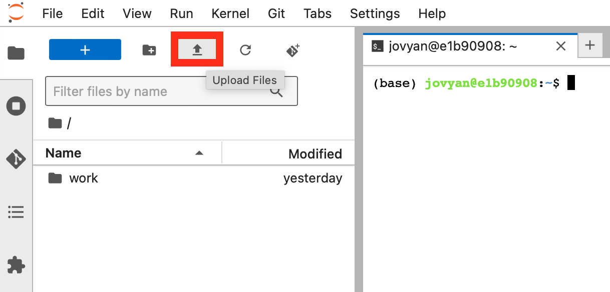

# Koyeb Serverless GPUs: Fine-Tune LLaMa 3.1 on the MLX Library Documentation

# Introduction

Large Language Models (LLMs) are fantastic tools for getting quick answers on programming questions.
However, their knowledge is not always up to date and they may not know about your favourite framework or library.
Maybe it's software that only your company uses, a new framework that's just come out or a new version of a popular library.

In this guide, we'll walk you through how to fine-tune an LLM on your favourite project's documentation.
This will enable the model to answer questions with (hopefully) correct, and up-to-date information.
We'll be using LLaMa 3.1 8B, Meta's latest open-source model and teach it about Apple's new deep learning framework: MLX.

We will first generate a custom LLM training dataset from Apple's documentation and publish it on the HuggingFace Hub.
Then, we'll fine-tune LLaMa 3.1 8B using QLORA, a training method which significantly reduces GPU memory usage and training time.
Finally, we'll deploy the model on Koyeb's serverless GPUs, enabling you to get answers to your questions in real-time.

**Quick disclaimer:** This guide is intended as an introductory overview. Fine-tuning a language model involves careful consideration of data distribution, hyperparameters, and continual pre-training. For production-level models, a more rigorous approach is required.

# Requirements

To successfully follow this tutorial, you will need the following:

- [Python 3.8](https://www.python.org) or later.
- An [OpenAI](platform.openai.com) API key.
- A [HuggingFace access token](https://huggingface.co/settings/tokens) with write permissions and access to [LLaMa 3.1 8B Instruct](https://huggingface.co/meta-llama/meta-llama-3.1-8b-instruct).
- A [Weights & Biases access token](https://wandb.ai) (Optional).

# Steps

- Configure the local environment.
- Build the Apple MLX documentation from source (Optional).
- Generate the training dataset with Python and the OpenAI API.
- Fine-tune the model using Jupyter Notebook on Koyeb.
- Deploy and use the fine-tuned model.

# Configure the local environment

First, we'll clone the repository for this project and create a Python virtual environment and install the required dependencies.

```bash
# Clone the repository
git clone https://github.com/koyeb/finetune-llama-on-koyeb.git
cd finetune-llama-on-koyeb

# Create a virtual environment
python3 -m venv venv

# Active the virtual environment (Windows)
.\venv\Scripts\activate.bat
# Active the virtual environment (Linux & macOS)
source ./venv/bin/activate
```

Now let's install the dependencies required for this project.

```bash
pip install datasets==2.16.1 openai==1.42.0 tqdm
```

The `datasets` library is used to push our dataset to the HuggingFace Hub and the `openai` library lets us interact with the OpenAI API.

Next, we'll login to the HuggingFace Hub.

```bash
huggingface-cli login
```

Follow the instructions in the terminal and paste your access token when prompted.

# Build the Apple MLX documentation from source (Optional)

The repository for this tutorial already contains the Apple MLX documentation in text format. However, if you want to build the documentation from source, you can follow the instructions below. Otherwise, you can skip to the next step.

You'll need to install doxygen to build the Apple MLX documentation from source.

```bash
# Install doxygen (macOS)
brew install doxygen
# Install doxygen (Linux)
sudo apt-get install doxygen
```

Now, you can clone the MLX repository and build the documentation using Doxygen.

```bash
# Clone the MLX repository
rm -r mlx ; git clone git@github.com:ml-explore/mlx.git

# Install the required dependencies and build the documentation in text format
cd mlx/docs
pip install -r mlx/requirements.txt
doxygen && make text

# Move back to the project directory
cd ../..
```

If everything went well, the `mlx/docs/build/text` directory should now contain the documentation in text format. If you encounter any issues, you can fallback to using the pre-built documentation from the repository.

# Generate the training dataset

To generate the training datase, we'll use the OpenAI API. The script `generate_dataset.py` in the repository does this for us. There's a lot going on in this script, so let's break it down:

* At the top of the file, we define the prompts used to generate questions and answers.
* After parsing the command-line arguments, we read all the documentation files in an array.
* For each chunk of documentation, we generate N questions using the `chat` endpoint of the OpenAI API.
  * We use OpenAI's structured output feature to ensure the model generates a list of questions. This is done by specifying a JSON schema in the `response_format` parameter.
* For each question, we generate an answer using the same `chat` endpoint.
* Finally, we write the question-answer pairs to a JSONL file and push it to the HuggingFace Hub.

We can now run the script, specifying the input directory, output file location, the OpenAI model to use and the HuggingFace repository to push the dataset to. This should be the name of your organization (or HuggingFace account) and the name of the dataset (for example `koyeb/Apple-MLX-QA`).

```bash
export OPENAI_API_KEY='your-openai-api-key'
python generate_dataset.py --input mlx/docs/build/text --output apple-mlx-qa.jsonl --model gpt-4o --repo koyeb/Apple-MLX-QA
```

This should use less than 10$ in OpenAI credits and take an hour or so. If you don't have an OpenAI API key or don't want to use it, you can skip to the next step and use [the dataset we published on HuggingFace](https://huggingface.co/datasets/koyeb/Apple-MLX-QA).

# Fine-tune the model using Jupyter Notebook on Koyeb

Now that we have our fine-tuning dataset, we can proceed with fine-tuning. The next step involves deploying a Jupyter Notebook server on a Koyeb GPU instance. To do this, you can visit the [One-Click App page for the Jupyter Notebook on Koyeb](https://www.koyeb.com/deploy/pytorch-jupyter) and follow the instructions on the page.

Once your service is started, visit the URL and connect to the Jupyter server using the password you set during the deployment process. Once you're logged into Jupyter, import the `notebook.ipynb` file by clicking on the "Upload" button in the Jupyter interface as shown below:



The rest of the instructions for this step are in the notebook. Once you're done, you can come back here to deploy and use the fine-tuned model on Koyeb.

# Deploy and use the fine-tuned model on Koyeb

This section teaches you how to use the model in Python code and how to deploy it for production use on Koyeb's serverless GPUs.

You can use your LORA adapter in Python code using `torch`, `transformers`, and `peft`. Here's an example:

```bash
pip install torch transformers peft
```

```bash
import torch
from peft import PeftModel
from transformers import AutoModelForCausalLM, AutoTokenizer

# Load the base model and tokenizer
model = AutoModelForCausalLM.from_pretrained(
    "meta-llama/Llama-3.1-8B-Instruct", torch_dtype=torch.bfloat16
)
tokenizer = AutoTokenizer.from_pretrained("meta-llama/Llama-3.1-8B-Instruct")

# Load the fine-tuned model using LORA
model = PeftModel.from_pretrained(
    model,
    "koyeb/Meta-Llama-3.1-8B-Instruct-Apple-MLX-Adapter",
).to("cuda")

# Define input using a chat template with a system prompt and user query
ids = tokenizer.apply_chat_template(
    [
        {
            "role": "system",
            "content": "You are a helpful AI coding assistant with expert knowledge of Apple's latest machine learning framework: MLX. You can help answer questions about MLX, provide code snippets, and help debug code.",
        },
        {
            "role": "user",
            "content": "How do you transpose a matrix in MLX?",
        },
    ],
    tokenize=True,
    add_generation_prompt=True,
    return_tensors="pt",
).to("cuda")

# Generate and print the response
print(
    tokenizer.decode(
        model.generate(input_ids=ids, max_new_tokens=256, temperature=0.5).tolist()[0][
            len(ids) :
        ]
    )
)
```

For production, you can deploy your fine-tune on Koyeb's serverless GPUs using vLLM with One-Click Apps.

1. Visit the [One-Click App page for vLLM](https://www.koyeb.com/deploy/vllm) and click the "Deploy" button.
2. Override the command args and specify the HuggingFace repository for your merged model: `["--model", "YOUR-ORG/Meta-LLaMa-3.1-8B-Instruct-Apple-MLX"]`
1. Set your HuggingFace access token in the `HF_TOKEN` environment variable. Optionally, set `VLLM_DO_NOT_TRACK` to `1` to disable telemetry.

Once deployed, you can interact with the model using the OpenAI API format. Here's an example using `curl`:

```bash
curl https://YOUR-SERVICE-URL.koyeb.app/v1/chat/completions \
  -H "Content-Type: application/json" \
  -d '{
     "messages": [{"role": "user", "content": "You are a helpful AI coding assistant with expert knowledge of Apple latest machine learning framework: MLX. You can help answer questions about MLX, provide code snippets, and help debug code."}],
     "temperature": 0.3
   }'
```

# Conclusion

Congratulations, you've successfully fine-tuned LLaMa 3.1 8B using QLORA!

Remember, fine-tuning is an iterative process. Feel free to experiment with different hyperparameters and training methods to get the best results. You can also work on increasing the size or improving the quality of your training dataset using additional data sources or data augmentation techniques.
